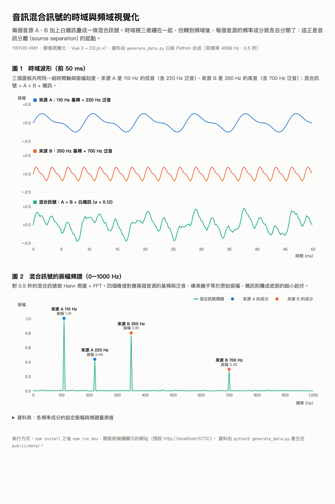

# 1151VIS HW1：以 Vue 3 + D3.js 製作靜態視覺化 — 音訊混合訊號的時域與頻域

- 學號：415085023
- 姓名：LiYing CHEN
- 主題：兩個音源 (A、B) 加上白雜訊疊成一條混合訊號，比較「時域波形」與「頻域振幅頻譜」。在時域裡三者纏在一起，轉到頻域後每個音源的頻率成分就各自分開，這也是音訊分離 (audio source separation) 的基本觀念。

---

## 1. 專案截圖



> 圖 1（上）：來源 A、來源 B、混合訊號前 50 ms 的時域波形，三個面板共用時間軸與振幅刻度。
> 圖 2（下）：混合訊號 0–1000 Hz 的振幅頻譜，四個峰值對應兩個音源的基頻與泛音。

---

## 2. GitHub 連結

- Repository：<https://github.com/liying-c/1151VIS-HW1-415085023-LiYingCHEN>
- 線上展示（GitHub Pages）：<https://liying-c.github.io/1151VIS-HW1-415085023-LiYingCHEN/>

---

## 3. 製作流程與相關操作說明

### 3.1 資料來源與選題

一開始想找公開的音訊分離資料集（例如 MUSDB18、LibriMix、WSJ0-2mix），但這些都是數 GB 的 WAV 音檔，有的還需要授權，且要先用 numpy / librosa 做訊號處理才能變成圖表能用的數值，不適合一份靜態視覺化作業。

因此改用 **自行合成的示範訊號**：用 Python 標準函式庫產生兩個音源（各含基頻 + 一個泛音）、加上高斯白雜訊，再自己實作 FFT 計算頻譜。所有參數寫在 `generate_data.py`，固定亂數種子，任何人執行都能得到相同資料。

| 音源 | 頻率成分 | 振幅 |
|---|---|---|
| 來源 A（低音） | 110 Hz 基頻 / 220 Hz 泛音 | 1.00 / 0.45 |
| 來源 B（高音） | 350 Hz 基頻 / 700 Hz 泛音 | 0.80 / 0.30 |
| 雜訊 | 高斯白雜訊 | σ = 0.12 |

取樣率 4096 Hz、2048 個樣本（0.5 秒），頻率解析度 2 Hz，所以四個頻率都剛好落在 FFT 的 bin 上。

### 3.2 環境建置

- 前端框架：**Vue 3**（單一檔案元件 `.vue`），建置工具 **Vite**
- 圖表函式庫：**D3.js v7**，以 npm 套件安裝並在元件內 `import * as d3 from 'd3'`，不使用 CDN
- 資料產生：Python 3（只用 `math` / `cmath` / `csv` / `random`，不需要第三方套件）

```bash
npm install          # 安裝 vue、d3、vite、@vitejs/plugin-vue
```

`package.json` 的相依套件：

| 套件 | 版本 | 用途 |
|---|---|---|
| `vue` | ^3.5 | UI 框架 |
| `d3` | ^7.9 | 比例尺、座標軸、線／面積產生器、CSV 讀取 |
| `vite` | ^7 | 開發伺服器與打包 |
| `@vitejs/plugin-vue` | ^6 | 讓 Vite 編譯 `.vue` 檔 |

### 3.3 產生資料

```bash
python3 generate_data.py
```

會在 `public/data/` 產生三個 CSV（Vite 會把 `public/` 底下的檔案原樣提供在網站根目錄）：

| 檔案 | 內容 |
|---|---|
| `public/data/waveform.csv` | 時域波形：`t, source_a, source_b, noise, mixture` |
| `public/data/spectrum.csv` | 單邊振幅頻譜：`freq_hz, source_a, source_b, mixture`（Hann 視窗 + FFT） |
| `public/data/peaks.csv` | 各音源的頻率成分：`source, freq_hz, amplitude` |

執行時會印出每個峰值「設定振幅」與「頻譜量測值」的對照，用來確認 FFT 正確。

### 3.4 視覺化設計（Vue 元件 + D3）

分工原則：**Vue 管元件生命週期與資料流，D3 管比例尺、座標軸與 SVG 繪圖。**

| 檔案 | 內容 |
|---|---|
| `src/App.vue` | 在 `onMounted` 用 `d3.csv(..., d3.autoType)` 同時載入三個 CSV，存成 `ref`；用 `computed` 算出每個峰值在頻譜上實際量到的值，再以 props 傳給子元件 |
| `src/components/WaveformChart.vue` | 圖 1 時域波形：三個小面板 (small multiples) 上下排列，各畫一條 `d3.line()`，共用同一組 `d3.scaleLinear()` 的 x（時間 ms）與 y（振幅）刻度 |
| `src/components/SpectrumChart.vue` | 圖 2 振幅頻譜：`d3.area()` + `d3.line()` 畫混合訊號頻譜，用 `d3.least()` 對齊四個峰值，畫圓點並直接標註「來源、頻率、振幅」，右上角有圖例 |
| `src/components/PeakTable.vue` | 資料表：純 Vue 模板 `v-for` 渲染，讓數值不靠顏色也能閱讀 |
| `src/series.js` | 三條序列的固定顏色與標籤（顏色跟著實體走，不跟著順序走） |
| `src/style.css` | 色票以 CSS custom properties 定義，支援系統深色模式 (`prefers-color-scheme`)；配色有用工具檢查色盲 (CVD) 可分辨性 |

圖表元件的做法：模板放一個 `<div ref="host">`，在 `onMounted` 與 `watch(props)` 時呼叫 `draw()`，用 `d3.select(host)` 清空後重畫整張 SVG；SVG 用 `viewBox` 在不同視窗寬度下自動縮放。

### 3.5 執行方式

```bash
cd 1151VIS-HW1-415085023-LiYingCHEN
python3 generate_data.py     # 產生 public/data/*.csv（repo 內已附，可略過）
npm install
npm run dev                  # 開發伺服器，預設 http://localhost:5173/
```

打包成靜態網站：`npm run build`，輸出在 `dist/`（可用 `npm run preview` 預覽）。

### 3.6 上傳 GitHub 與分享

```bash
git init
git add .
git commit -m "HW1: static D3.js visualization of audio mixture spectrum"
gh repo create 1151VIS-HW1-415085023-LiYingCHEN --public --source=. --remote=origin --push
```

分享給助教 / 老師：到 repository 的 **Settings → Collaborators → Add people**，輸入老師提供的 email 送出邀請。

### 3.7 部署到 GitHub Pages

`.github/workflows/deploy.yml` 會在每次推到 `master` 時自動執行 `npm ci` → `npm run build`，再用 `actions/deploy-pages` 把 `dist/` 發佈到 GitHub Pages，所以 `dist/` 不需要進 repo。Pages 的來源設定為 **GitHub Actions**：

```bash
gh api -X POST repos/liying-c/1151VIS-HW1-415085023-LiYingCHEN/pages -f build_type=workflow
```

`vite.config.js` 設 `base: './'`，打包後用相對路徑載入資源與 CSV，放在 `/<repo 名稱>/` 子路徑下也能正常執行。

### 3.8 檔案結構

```
.
├── index.html                 # Vite 進入點，掛載 #app
├── package.json               # 相依：vue、d3、vite、@vitejs/plugin-vue
├── vite.config.js
├── .github/workflows/deploy.yml   # 自動 build + 部署到 GitHub Pages
├── generate_data.py           # 合成訊號 + FFT，產生 public/data/*.csv
├── public/
│   └── data/
│       ├── waveform.csv
│       ├── spectrum.csv
│       └── peaks.csv
├── src/
│   ├── main.js                # createApp(App).mount('#app')
│   ├── App.vue                # 載入資料、版面、組合子元件
│   ├── series.js              # 序列顏色與標籤
│   ├── style.css              # 色票（含深色模式）與全域樣式
│   └── components/
│       ├── WaveformChart.vue  # 圖 1 時域波形（D3）
│       ├── SpectrumChart.vue  # 圖 2 振幅頻譜（D3）
│       └── PeakTable.vue      # 資料表（Vue 模板）
├── screenshot.png             # 專案截圖
├── .gitignore                 # 排除 node_modules/、dist/ 等
└── README.md
```
